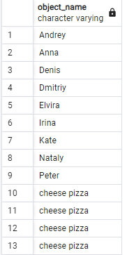
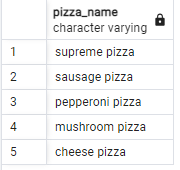
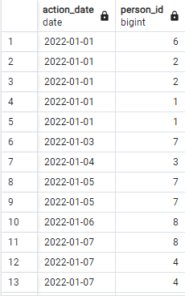
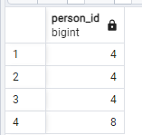
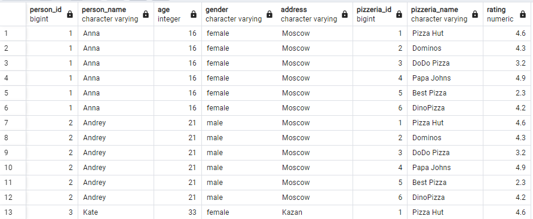
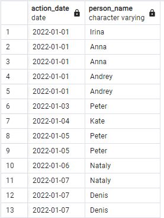
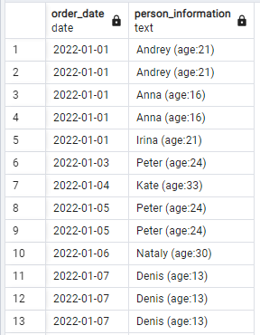
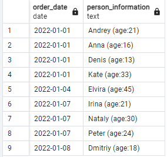
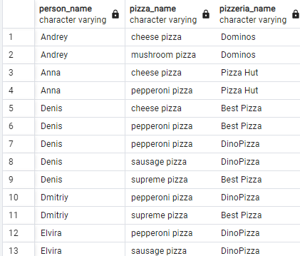

## Day01

### exercise 01

task:

Please modify a SQL statement from “exercise 00” by removing the object_id column. Then change ordering by object_name for part of data from the `person` table and then from `menu` table (like presented on a sample below). Please save duplicates!

```

SELECT object_name
FROM (
    SELECT name AS object_name, 1 AS sort_order
    FROM person
    UNION ALL
    SELECT pizza_name AS object_name, 2 AS sort_order
    FROM menu
) AS combined_data
ORDER BY sort_order, object_name;

```



### exercise 02

task:

Please write a SQL statement which returns unique pizza names from the `menu` table and orders them by pizza_name column in descending mode. Please pay attention to the Denied section.

```

SELECT pizza_name
FROM (
    SELECT pizza_name, 
           ROW_NUMBER() OVER (PARTITION BY pizza_name ORDER BY pizza_name) AS rn
    FROM menu
) AS numbered_pizzas
WHERE rn = 1
ORDER BY pizza_name DESC;

```



### exercise 03

task:

Please write a SQL statement which returns common rows for attributes order_date, person_id from `person_order` table from one side and visit_date, person_id from `person_visits` table from the other side (please see a sample below). In other words, let’s find identifiers of persons, who visited and ordered some pizza on the same day. Actually, please add ordering by action_date in ascending mode and then by person_id in descending mode.

```

SELECT order_date AS action_date, person_id
FROM person_order
WHERE (order_date, person_id) IN (
    SELECT visit_date, person_id
    FROM person_visits
)
ORDER BY action_date ASC, person_id DESC;

```



### exercise 04

task:

Please write a SQL statement which returns a difference (minus) of person_id column values with saving duplicates between `person_order` table and `person_visits` table for order_date and visit_date are for 7th of January of 2022

```

SELECT person_id
FROM person_order
WHERE order_date = '2022-01-07'

UNION ALL

SELECT person_id
FROM person_order po
WHERE order_date = '2022-01-07'
AND person_id NOT IN (
    SELECT person_id
    FROM person_visits
    WHERE visit_date = '2022-01-07'
);

```



### exercise 05

task:

Please write a SQL statement which returns all possible combinations between `person` and `pizzeria` tables and please set ordering by person identifier and then by pizzeria identifier columns. Please take a look at the result sample below. Please be aware column's names can be different for you.

```

SELECT 
    person.id AS person_id,
    person.name AS person_name,
    person.age,
    person.gender,
    person.address,
    pizzeria.id AS pizzeria_id,
    pizzeria.name AS pizzeria_name,
    pizzeria.rating
FROM 
    person
CROSS JOIN 
    pizzeria
ORDER BY 
    person.id, 
    pizzeria.id;

```



### exercise 06

task:

Let's return our mind back to exercise #03 and change our SQL statement to return person names instead of person identifiers and change ordering by action_date in ascending mode and then by person_name in descending mode. Please take a look at a data sample below.

```

SELECT 
    po.order_date AS action_date, 
    (SELECT name FROM person WHERE id = po.person_id) AS person_name
FROM 
    person_order po
WHERE 
    po.order_date IN (
        SELECT visit_date 
        FROM person_visits 
        WHERE person_id = po.person_id
    )
ORDER BY 
    action_date ASC, 
    person_name DESC;

```



### exercise 07

task:

Please write a SQL statement which returns the date of order from the `person_order` table and corresponding person name (name and age are formatted as in the data sample below) which made an order from the `person` table. Add a sort by both columns in ascending mode.

```

SELECT 
    po.order_date,
    CONCAT(p.name, ' (age:', p.age, ')') AS person_information
FROM 
    person_order po
INNER JOIN 
    person p ON po.person_id = p.id
ORDER BY 
    po.order_date ASC, 
    person_information ASC;

```



### exercise 08

task:

Please rewrite a SQL statement from exercise #07 by using NATURAL JOIN construction. The result must be the same like for exercise #07. 

```

SELECT 
    po.order_date,
    CONCAT(p.name, ' (age:', p.age, ')') AS person_information
FROM 
    person_order po
NATURAL JOIN 
    person p
ORDER BY 
    po.order_date ASC, 
    person_information ASC;

```



### exercise 09

task:

Please write 2 SQL statements which return a list of pizzerias names which have not been visited by persons by using IN for 1st one and EXISTS for the 2nd one.

```

SELECT name 
FROM pizzeria 
WHERE id NOT IN (SELECT DISTINCT pizzeria_id FROM person_visits);

```


### exercise 10

task:

Please write a SQL statement which returns a list of the person names which made an order for pizza in the corresponding pizzeria. 
The sample result (with named columns) is provided below and yes ... please make ordering by 3 columns (`person_name`, `pizza_name`, `pizzeria_name`) in ascending mode.

```

SELECT 
    p.name AS person_name, 
    m.pizza_name, 
    pi.name AS pizzeria_name
FROM 
    person_order po
JOIN 
    person p ON po.person_id = p.id
JOIN 
    menu m ON po.menu_id = m.id
JOIN 
    pizzeria pi ON m.pizzeria_id = pi.id
ORDER BY 
    p.name, 
    m.pizza_name, 
    pi.name;

```



