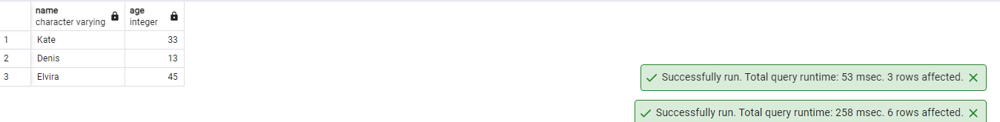
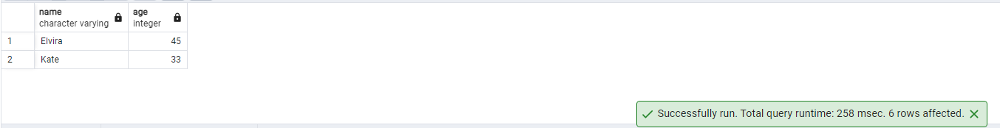
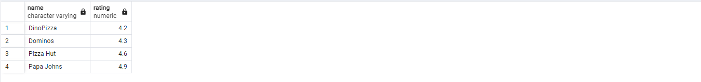
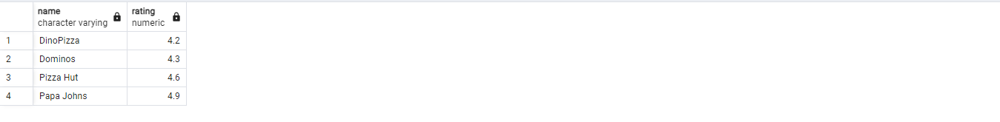
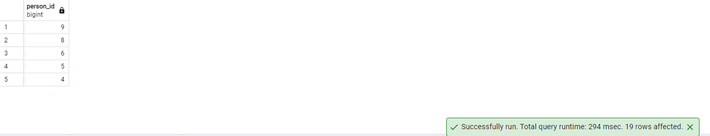
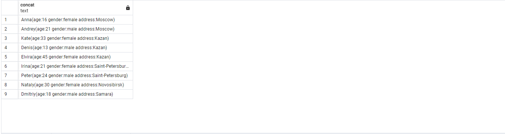
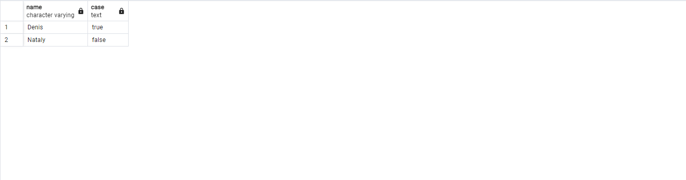
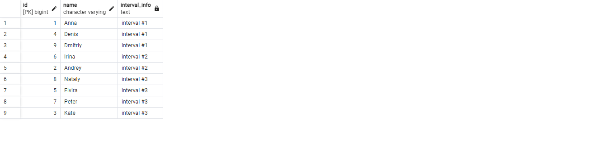
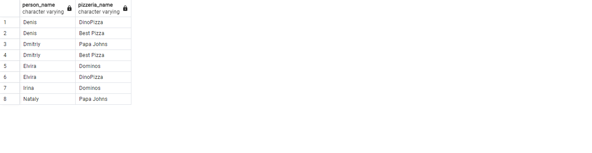

## day 00

### exercise 00

Task:
Please make a select statement which returns all person's names and person's ages from the city ‘Kazan’.

```
SELECT name , age
from person
where address ='Kazan'
```




### exercise 01

Task:
Please make a select statement which returns names , ages for all women from the city ‘Kazan’. Yep, and please sort result by name.

```
SELECT name , age
from person
where address ='Kazan' and gender = 'female'
order by name
```




### exercise 02

Task:
Please make 2 syntax different select statements which return a list of pizzerias (pizzeria name and rating) with rating between 3.5 and 5 points (including limit points) and ordered by pizzeria rating.
- the 1st select statement must contain comparison signs  (<=, >=)
- the 2nd select statement must contain `BETWEEN` keyword

part1
```
SELECT name , rating
from pizzeria
where rating <= '5.0' and rating >= '3.5'
order by rating
```



part2
```
SELECT name , rating
from pizzeria
where rating between 3.5 and 5.0
order by rating
```



### exercise 03

Task:
Please make a select statement which returns the person's identifiers (without duplication) who visited pizzerias in a period from 6th of January 2022 to 9th of January 2022 (including all days) or visited pizzeria with identifier 2. Also include ordering clause by person identifier in descending mode.

```
SELECT distinct person_id
from person_visits
where visit_date between '2022-01-06' and '2022-01-09'
order by person_id desc
```



### exercise 04

Task:
Please make a select statement which returns one calculated field with name ‘person_information’ in one string like described in the next sample:

```
SELECT CONCAT(name, '(age:', age ,' ', 'gender:' , gender,' ' ,'address:' , address ,')')  FROM person;
```



### exercise 05

Task:
Please make a select statement which returns person's names (based on internal query in `SELECT` clause) who made orders for the menu with identifiers 13 , 14 and 18 and date of orders should be equal 7th of January 2022. Be aware with "Denied Section" before your work.

```
SELECT name 
FROM person    
WHERE person.id in (SELECT person_id
				   from person_order
				   where menu_id in (13,14,18) and order_date = '2022-01-07') 
```


### exercise 06

Task:
Please use SQL construction from Exercise 05 and add a new calculated column (use column's name ‘check_name’) with a check statement (a pseudo code for this check is presented below) in the `SELECT` clause.

```
SELECT name,
       CASE 
           WHEN name = 'Denis' THEN 'true' 
           ELSE 'false' 
       END 
FROM person    
WHERE id IN (SELECT person_id
              FROM person_order
              WHERE menu_id IN (13, 14, 18) 
              AND order_date = '2022-01-07');
```


### exercise 07

Task:
Let’s apply data intervals for the `person` table. 
Please make a SQL statement which returns a person's identifiers, person's names and interval of person’s ages (set a name of a new calculated column as ‘interval_info’) based on pseudo code below. 

```
SELECT id,
       name,
       CASE 
           WHEN age >= 10 AND age <= 20 THEN 'interval #1'
           WHEN age > 20 AND age < 24 THEN 'interval #2'
           ELSE 'interval #3'
       END AS interval_info
FROM person
ORDER BY interval_info ASC; 
```



### exercise 08

Task:
Please make a SQL statement which returns all columns from the `person_order` table with rows whose identifier is an even number. The result have to order by returned identifier.

```
select * 
from person_order
where id%2 =0
order by id
```


### exercise 09

Task:
Please make a select statement that returns person names and pizzeria names based on the `person_visits` table with date of visit in a period from 07th of January to 09th of January 2022 (including all days) (based on internal query in `FROM` clause) .


Please take a look at the pattern of the final query.

    SELECT (...) AS person_name ,  -- this is an internal query in a main SELECT clause
            (...) AS pizzeria_name  -- this is an internal query in a main SELECT clause
    FROM (SELECT … FROM person_visits WHERE …) AS pv -- this is an internal query in a main FROM clause
    ORDER BY ...

Please add a ordering clause by person name in ascending mode and by pizzeria name in descending mode

```
SELECT (SELECT name FROM person WHERE id = pv.person_id) AS person_name,
       (SELECT name FROM pizzeria WHERE id = pv.pizzeria_id) AS pizzeria_name 
FROM (SELECT person_id, pizzeria_id 
      FROM person_visits 
      WHERE visit_date BETWEEN '2022-01-07' AND '2022-01-09') AS pv
ORDER BY person_name ASC, pizzeria_name DESC;
```

